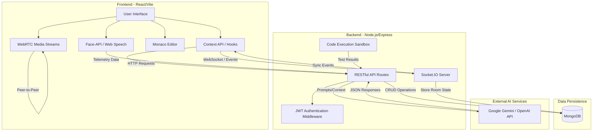

# AI-Driven Interview Simulation & Recruitment System
## Comprehensive Project Documentation

---

## Table of Contents
1. [Problem Statement](#1-problem-statement)
2. [Difference (Traditional vs. Now)](#2-difference-traditional-vs-now)
3. [Proposed Solution](#3-proposed-solution)
4. [Overall Architecture](#4-overall-architecture)
5. [Technologies Used](#5-technologies-used)
   - [Architecture Details](#51-architecture-details)
   - [Agents Used](#52-agents-used)
   - [Architecture & Module Comparison Tables](#53-architecture--module-comparison-tables)
   - [Algorithms Used](#54-algorithms-used)
6. [Implementation Phases](#6-implementation-phases)
7. [Applications](#7-applications)
8. [System Security & Scalability](#8-system-security--scalability)
9. [Conclusion](#9-conclusion)
10. [References](#10-references)

---

<div style="page-break-after: always;"></div>

## 1. Problem Statement

In the rapidly evolving landscape of the technology industry, the recruitment process for software engineering and technical roles has become increasingly complex, resource-intensive, and fraught with inefficiencies. The modern hiring pipeline is fundamentally broken across multiple dimensions, impacting recruiters, candidates, and educational institutions alike. 

### 1.1 The Recruiter's Bottleneck
The manual screening and interviewing of candidates demand a massive investment of time from senior engineering staff. A standard technical interview process often requires multiple rounds of 1-hour sessions, diverting critical talent away from product development. Furthermore, traditional hiring methodologies rely on fragmented systems. Recruiters must navigate multiple disjointed platforms—such as video conferencing tools (Zoom, Google Meet) running in parallel with separate code-sharing environments (Google Docs, HackerRank). This disjointed approach not only creates a jarring user experience but also introduces significant friction, leading to prolonged hiring cycles, increased administrative overhead, and lost data between platforms.

### 1.2 The Subjectivity of Evaluation
Human-led interviews are inherently subjective. Interviewers carry unconscious biases regarding a candidate's background, communication style, or even the time of day the interview takes place. Assessing a candidate's holistic profile—which encompasses their technical coding proficiency, their ability to communicate complex logic, their problem-solving approach under pressure, and their overall confidence—is exceptionally difficult to quantify objectively. Two different interviewers may evaluate the exact same candidate completely differently based on unstandardized rubrics. There is a critical lack of biometric and objective communication analytics in the standard evaluation pipeline.

### 1.3 The Candidate's Dilemma
From the candidate's perspective, the current ecosystem lacks comprehensive, realistic practice environments. Job seekers experience high levels of anxiety due to the unpredictable nature of technical interviews. While platforms exist for isolated algorithmic practice (e.g., LeetCode), they completely fail to simulate the pressurized, interactive environment of a real interview where behavioral cues, spoken thought processes, and real-time communication are heavily scrutinized. Candidates struggle to receive actionable, objective feedback on their performance. They might fail an interview not because their code was wrong, but because they hesitated too much, failed to maintain eye contact, or lacked confidence—metrics they are entirely unaware of.

### 1.4 The Institutional Gap
Educational institutions and coding bootcamps struggle to provide scalable, 1-on-1 interview practice for hundreds of students. Faculty members cannot possibly conduct mock interviews for every student, leaving graduates technically capable but woefully underprepared for the actual interview environment. 

The absence of a unified, intelligent platform that can seamlessly handle automated AI-driven practice, peer-to-peer collaborative learning, competitive coding, and professional live recruiter assessments represents a profound gap in the market. There is a pressing need for a system to standardize evaluation, provide deep behavioral analytics, and bridge the divide between preparation and recruitment.

<div style="page-break-after: always;"></div>

## 2. Difference (Traditional vs. Now)

The landscape of technical interviewing is undergoing a paradigm shift. Below is an exhaustive comparison of traditional methodologies versus the modern, unified approach facilitated by this platform.

### Traditional Approach (The Problem)

*   **Fragmented Tooling:** Relies on a combination of separate applications. A typical interview requires opening Zoom for video, a Google Doc or rudimentary shared editor for coding, and an IDE for compiling. These systems do not talk to each other.
*   **Manual, Subjective Evaluation:** Interviewers manually take notes during the session. They subjectively judge the candidate's confidence, communication skills, and technical depth. This is prone to human error and bias.
*   **High Latency in Feedback:** Candidates often wait days or weeks to receive generalized feedback from an HR representative, which is rarely specific enough to be actionable (e.g., "We went with a more experienced candidate" instead of "Your algorithmic complexity was suboptimal and you paused for 45 seconds during the explanation").
*   **Lack of Analytics & Biometrics:** No objective measurement of soft skills. Non-verbal cues, speaking pace (words per minute), and hesitation are judged purely on human perception without data backing.
*   **Resource Heavy Initial Screening:** Companies waste thousands of engineering hours conducting initial phone screens or basic coding tests that could be automated.
*   **Static Preparation:** Candidates practice on static coding platforms without the pressure of an active observer, failing to build the "muscle memory" of communicating while coding.
*   **Zero Anti-Cheat Mechanisms:** Remote interviews often suffer from candidates looking at secondary screens or having others off-camera assisting them, which is incredibly difficult for a human to catch consistently.

### Now (The Proposed System)

*   **Unified Ecosystem:** A single, integrated full-stack platform that natively combines high-definition video conferencing, a multi-language execution-ready code editor (Monaco), real-time chat, and evaluation tools in one seamless interface.
*   **AI-Driven & Objective Assessment:** Utilizes Large Language Models (LLMs) to dynamically generate context-aware questions and evaluate answers objectively based on predefined rubrics, entirely removing human bias from the initial screening layer.
*   **Real-Time Actionable Feedback:** Generates instant, comprehensive reports the second the interview concludes. These reports detail algorithmic performance, time complexity, and soft skills.
*   **Advanced Biometric & Voice Analytics:** Integrates tools like `face-api.js` to monitor facial expressions (detecting stress, confidence, neutral states) and voice analytics to objectively quantify communication effectiveness (Words Per Minute, pause counts, filler words).
*   **Automated Proctoring:** Built-in AI proctoring tracks eye movement, detects if the candidate looks away consistently, flags multiple faces in the frame, and monitors browser tab-switching, ensuring academic and professional integrity.
*   **Dynamic Collaborative Practice:** Introduces 1v1 competitive coding battles and peer-to-peer mock interviews via WebRTC, simulating real-world pressure and encouraging communicative problem-solving with peers globally.

<div style="page-break-after: always;"></div>

## 3. Proposed Solution

To entirely resolve the profound inefficiencies and subjective nature of traditional technical recruitment, we propose a state-of-the-art, AI-Driven Interview Simulation & Recruitment System. This platform is meticulously designed to revolutionize the entire lifecycle of software engineering preparation and assessment.

The proposed solution provides a single, unified ecosystem that caters to multiple stakeholders: job-seeking candidates, student peers, and professional enterprise recruiters. 

### Core Modules of the Solution:

1.  **AI Mock Interview Engine (The Core Validator):** 
    This is not a static quiz. The engine dynamically crafts adaptive, context-aware technical and behavioral questions based on the user's resume, selected domain (Frontend, Backend, Fullstack, DevOps), and experience level. The engine evaluates the candidate's spoken answers (transcribed via Web Speech API) and code submissions. Crucially, it employs advanced analytics to monitor speaking pace, pause durations, and facial expression cues, providing a holistic, objective evaluation of both hard and soft skills in a generated report.

2.  **Competitive Coding Battle (Gamified Learning):** 
    To build speed and accuracy under pressure, the system introduces a 1v1 battle module. Utilizing real-time synchronization via Socket.IO, candidates are matched globally. They face off on algorithmic challenges in a shared, synchronized sandbox environment. The server automatically evaluates their code against hidden test cases, assessing execution time and memory complexity, automatically declaring a winner and updating global Elo ratings.

3.  **Peer-to-Peer Mock Interview Network:** 
    Candidates can discover and invite other users for dual-role mock interviews. Using WebRTC for ultra-low latency peer-to-peer video/audio, candidates take turns acting as the interviewer and interviewee in a shared coding workspace. This builds empathy, improves communication skills, and allows for peer-reviewed 5-star rating systems.

4.  **Recruiter Live Interview Portal (Enterprise Grade):** 
    Equips hiring managers with a powerful centralized dashboard. Recruiters can schedule sessions, dispatch automated email invites with secure room links, and conduct live interviews with native video/audio and screen sharing. The room includes a persistent side-panel displaying the candidate's parsed resume and a 4-tier interactive scoring rubric (Communication, Technical, Problem Solving, Code Quality) that instantly generates a company-branded evaluation PDF upon session completion.

5.  **Interactive AI Career Coach:** 
    A persistent, conversational agent that provides continuous, personalized guidance. It analyzes a user's current skill set and career goals to generate dynamic, interactive node-based learning roadmaps (visualizing paths for React, Node, System Design, etc.) and answers complex technical queries 24/7.

By centralizing these diverse functionalities, the proposed solution significantly reduces hiring overhead, drastically eliminates systemic biases, and empowers candidates to prepare effectively for the modern tech landscape.

<div style="page-break-after: always;"></div>

## 4. Overall Architecture

The system is built upon a robust, highly scalable Microservice-inspired Monolith architecture, utilizing the MERN stack (MongoDB, Express.js, React, Node.js), heavily augmented with real-time bidirectional communication protocols (WebSockets and WebRTC).

### 4.1 System Topology



### 4.2 Architectural Flow Description

1.  **Client Tier (Frontend):** 
    A Single Page Application (SPA) built with React 18 and Vite. It handles the complex user interface, state management, and real-time interactions. The client acts as the central hub for collecting biometric data (camera feed to `face-api.js`, microphone feed to Web Speech API). It communicates with the backend via RESTful HTTP requests for standard CRUD operations and establishes persistent WebSocket connections for real-time synchronization.
2.  **Application Tier (Backend API & Sockets):** 
    A Node.js and Express.js server that processes API requests, manages secure JWT authentication, and acts as the signaling server for WebRTC connections. Crucially, it houses the **Code Execution Sandbox**, a secured environment that takes untrusted user code, executes it against hidden test cases, and measures time/space complexity before returning results to the client.
3.  **Data Tier (MongoDB):** 
    A NoSQL MongoDB database (interfaced via Mongoose) that stores heavily nested, schema-less data perfectly suited for complex evaluation reports, user profiles, historical code submissions, and dynamic roadmap nodes.
4.  **AI & External Layer:** 
    The backend securely connects to Large Language Models (Gemini/OpenAI) via API keys stored in environment variables. It abstracts complex prompt engineering on the server side to ensure candidates cannot manipulate the AI, converting user input into structured LLM queries and parsing the JSON responses back to the client.

### 4.3 WebRTC Signaling Architecture (Peer & Recruiter Rooms)

```mermaid
sequenceDiagram
    participant PeerA as Candidate A (Client)
    participant Server as Signaling Server (Socket.IO)
    participant PeerB as Candidate B (Client)

    PeerA->>Server: join-room (roomId)
    Server->>PeerB: user-connected (PeerA ID)
    
    Note over PeerA, PeerB: WebRTC Negotiation Begins
    PeerB->>Server: WebRTC Offer
    Server->>PeerA: Receive WebRTC Offer
    
    PeerA->>Server: WebRTC Answer
    Server->>PeerB: Receive WebRTC Answer
    
    PeerA->>Server: ICE Candidate
    Server->>PeerB: Receive ICE Candidate
    PeerB->>Server: ICE Candidate
    Server->>PeerA: Receive ICE Candidate
    
    Note over PeerA, PeerB: Direct P2P Connection Established
    PeerA<-->>PeerB: Direct Audio/Video/Screen Stream
```

<div style="page-break-after: always;"></div>

## 5. Technologies Used

The platform is engineered using a modern, cutting-edge technology stack to ensure ultra-low latency, vast scalability, and an enterprise-grade user experience that mimics industry-standard tools like VS Code.

### 5.1 Architecture Details

**Frontend Layer:**
*   **React 18 & Vite:** Selected for its concurrent rendering features and incredibly fast Hot Module Replacement (HMR). Vite significantly reduces build times compared to Webpack.
*   **Tailwind CSS:** A utility-first CSS framework used to build the Enterprise Light Theme. It ensures highly responsive design without the bloat of traditional CSS stylesheets.
*   **Monaco Editor (`@monaco-editor/react`):** The exact editor that powers Microsoft's VS Code. It provides native syntax highlighting, autocompletion, intelligent code folding, and multi-language support (JavaScript, Python, Java, C++, C).
*   **Recharts:** A composable charting library built on React components used to render the Voice Analytics Dashboard (Words Per Minute line graphs, Confidence Score pie charts).
*   **Face-api.js:** A JavaScript API for face detection and face recognition in the browser implemented on top of the tensorflow.js core API. It operates entirely client-side, ensuring user privacy while calculating stress and expression confidence.

**Backend Layer:**
*   **Node.js & Express.js:** Provides a fast, non-blocking I/O, event-driven architecture perfect for handling thousands of concurrent WebSocket connections and REST API requests simultaneously.
*   **Socket.IO:** A library that enables low-latency, bidirectional, and event-based communication between a client and a server. It manages the state of coding rooms, synchronizing keystrokes in the shared editor in real-time.
*   **WebRTC (Real-Time Communication):** HTML5 APIs (`RTCPeerConnection`, `getDisplayMedia`) used to establish direct peer-to-peer connections for streaming video, audio, and screen sharing, bypassing the server entirely for massive bandwidth savings.
*   **JWT (JSON Web Tokens) & BcryptJS:** Secures the application. Passwords are salted and hashed via Bcrypt before entering the database. JWTs are used for stateless authentication across API boundaries.
*   **File Parsing (Mammoth, PDF-Parse, Multer):** Used in the recruiter portal to allow candidates to upload `.pdf` or `.docx` resumes. The backend parses this data and streams it to the recruiter's side-panel.

**Database Layer:**
*   **MongoDB & Mongoose:** A flexible NoSQL database. Mongoose provides a rigorous modeling environment, allowing us to enforce schemas for Users, Interviews, and Battles while maintaining the flexibility of document storage for unpredictable AI report outputs.

### 5.2 Agents Used

The system incorporates sophisticated autonomous AI agents that act as the intelligence layer of the application.

1.  **AI Mock Interviewer Agent:**
    *   **Role:** Acts as the technical evaluator.
    *   **Input Mechanics:** Receives a system prompt containing the candidate's chosen tech stack (e.g., MERN, AWS), experience level (e.g., Mid-Level), and context from the previous question.
    *   **Algorithm:** Uses an adaptive sequencing algorithm. If the candidate answers correctly and quickly, it increases the difficulty parameters in the next prompt.
    *   **Output:** Returns highly structured JSON containing the `question_text`, `expected_keywords`, `difficulty`, and `time_limit`.

2.  **AI Career Coach Agent:**
    *   **Role:** Acts as a 24/7 mentor and roadmap generator.
    *   **Input Mechanics:** Chat-based context window. It ingests the user's current profile skills and their stated career objective (e.g., "I want to become a Senior Data Scientist").
    *   **Algorithm:** Analyzes skill gaps and maps out a chronological curriculum.
    *   **Output:** Generates JSON arrays of nodes and edges that the frontend translates into an interactive `React Flow` graph, alongside natural language conversational advice.

3.  **Client-Side Proctoring Agent (Heuristic Agent):**
    *   **Role:** Maintains academic integrity.
    *   **Input Mechanics:** Continuous feed from the webcam and browser Window API.
    *   **Algorithm:** 
        *   Checks `faceapi.detectAllFaces()` array length every 2 seconds. If > 1, flag `MULTI_FACE_DETECTED`.
        *   Checks iris positioning. If standard deviation from center exceeds threshold, flag `LOOKING_AWAY`.
        *   Listens to `window.onblur`. If triggered, flag `TAB_SWITCH`.
    *   **Output:** Pushes security violation events via WebSocket to the server, which immediately terminates the interview or docks the candidate's trust score.

<div style="page-break-after: always;"></div>

### 5.3 Architecture & Module Comparison Tables

**Table 1: Module Architecture & Latency Comparison**

| Feature/Module | Communication Protocol | Primary Compute Location | Key Technologies Utilized | Latency Requirement | Scalability Strategy |
| :--- | :--- | :--- | :--- | :--- | :--- |
| **AI Mock Interview** | REST API & HTTP Polling | Backend (AI APIs) & Client (FaceAPI) | Gemini API, Monaco, Face-api.js | Moderate (1-2s) | Stateless API instances, Client-side heavy lifting |
| **1v1 Code Battle** | WebSocket (Socket.IO) | Server (Room State & Compilation) | Socket.IO, Monaco, Node Sandbox | Ultra-Low (<50ms) | Redis Adapter for Socket.IO multi-node clustering |
| **Peer Mock (P2P)** | WebRTC & WebSocket | Client-to-Client (P2P Mesh) | WebRTC, Socket.IO (Signaling only) | Ultra-Low (<50ms) | P2P architecture offloads media bandwidth from server |
| **Recruiter Portal** | WebRTC, WebSocket, REST | Hybrid (P2P Media, Server Data APIs) | WebRTC, JWT, Express, PDF-Parse | Ultra-Low (<50ms) | Media handled P2P; REST API handles document parsing |
| **Career Coach** | REST API | Backend (AI APIs) | Gemini/OpenAI API, React Flow | Low (<1s) | Database caching of generated roadmaps |

**Table 2: Traditional vs Modern Stack Comparison**

| Component | Traditional Recruitment Stack | Modern System Stack (Proposed) | Improvement Metric |
| :--- | :--- | :--- | :--- |
| **Video Conferencing** | Zoom, Google Meet, MS Teams | Native WebRTC (In-Browser) | Eliminates 3rd-party app installation; Zero context switching |
| **Code Collaboration** | Google Docs, HackerRank (External) | Integrated Monaco Editor + Socket.IO | Provides exact IDE experience; Real-time sync without page reloads |
| **Candidate Sourcing** | LinkedIn, Email threads, Spreadsheets | Internal Discovery Engine & Invites | Centralized candidate pool with skill-based filtering |
| **Evaluation Metrics** | Manual Notes, Subjective Memory | AI-driven Voice & Facial Analytics | 100% objective data (WPM, Confidence %); Removes human bias |
| **Feedback Loop** | Days/Weeks via generic Email | Instant Automated Report Dashboard | Candidates receive actionable graphs immediately upon completion |
| **Proctoring** | Manual human observation | Automated Tab-blur & Multi-face tracking | Catch cheating automatically without dedicating a human watcher |

<div style="page-break-after: always;"></div>

### 5.4 Algorithms Used

The intelligence of the platform relies heavily on specific algorithms designed for evaluation, matching, and synchronization.

#### 1. Adaptive Question Sequencing (Dynamic Difficulty Adjustment)
The Mock Interview Engine does not serve a static list of questions. It uses an adaptive algorithm based on Item Response Theory (IRT).
*   **Initialization:** Start at `difficulty = medium` for the requested domain.
*   **Evaluation Phase:** Candidate answers. System calculates an `accuracy_score` (0-100) based on AI keyword matching and code execution correctness.
*   **Adjustment Logic:**
    ```javascript
    function calculateNextDifficulty(currentDifficulty, accuracyScore) {
        if (accuracyScore > 85) {
            return Math.min(currentDifficulty + 1, MAX_DIFFICULTY); // Increase difficulty
        } else if (accuracyScore < 40) {
            return Math.max(currentDifficulty - 1, MIN_DIFFICULTY); // Decrease difficulty
        }
        return currentDifficulty; // Maintain difficulty
    }
    ```
*   **Context Passing:** The next prompt to the LLM includes: `generate a question of level [NextDifficulty], avoiding concepts similar to [PreviousQuestion]`.

#### 2. Code Battle Matchmaking Algorithm (Queue & Rank)
To ensure fair 1v1 battles, candidates must be matched with peers of similar skill levels.
*   Users join a global waiting pool via WebSocket.
*   **Algorithm:** 
    1. Scan pool for users within ±100 Elo points.
    2. If match found -> Generate Room ID -> Emit `match-found` event.
    3. If no match within 15 seconds, expand search radius to ±300 Elo points.
    4. If no match within 30 seconds, match with an AI bot to prevent user drop-off.

#### 3. Heuristic Biometric Aggregation Algorithm
Raw data from `face-api.js` updates at 30 frames per second, creating massive noise. The algorithm aggregates this into a readable score.
*   **Smoothing:** Calculates a rolling average of 'confidence' expression over 5-second windows.
*   **Spike Detection:** If 'stress' expression spikes > 80% for more than 3 consecutive seconds during a specific question, that question is flagged as a "Struggle Point" in the final report.

#### 4. Operational Transformation (OT) Concepts for Editor Sync
When two peers type in the same code editor simultaneously, race conditions occur. While a full OT algorithm is incredibly complex, the system implements a simplified client-authoritative lock mechanism over Socket.IO.
*   When Client A types, it acquires a 50ms lock. Client B's incoming keystrokes are buffered and applied immediately after the lock releases, ensuring document consistency without heavy server-side conflict resolution.

#### 5. Code Execution & Complexity Sandbox Logic
Untrusted code must be executed safely to determine efficiency.
*   **Execution:** Code is wrapped in a sandboxed Node `vm` context (or isolated Docker container in production).
*   **Time Complexity:** 
    ```javascript
    const start = process.hrtime.bigint();
    // Run user code against test case
    const end = process.hrtime.bigint();
    const executionTimeMs = Number(end - start) / 1000000;
    ```
*   **Space Complexity:** Measured by tracking `process.memoryUsage().heapUsed` before and after execution.

<div style="page-break-after: always;"></div>

## 6. Implementation Phases

The development, testing, and deployment of the system are structured into distinct, iterative Sprints (Phases) following Agile methodologies.

### Phase 1: Architecture Foundation & Database Modeling (Weeks 1-2)
*   **Environment Setup:** Initialization of the Vite React frontend and Express Node.js backend.
*   **Database Schema Design:** Creating robust Mongoose models. For example, the `User` schema must handle both candidate profiles and recruiter data. The `Report` schema utilizes mixed types to store complex AI-generated JSON analytics.
*   **Authentication Flow:** Implementing secure JWT generation on login/registration, creating HTTP-only cookie handlers, and setting up protected routes via React Router.
*   **Global State Management:** Implementing React Context for User Auth and Application Theme (Dark/Light mode).

### Phase 2: Core Interview Engine & AI Integration (Weeks 3-4)
*   **Monaco Editor Implementation:** Embedding the editor component, setting up themes, and writing the logic to switch language syntax highlighting dynamically.
*   **LLM API Integration:** Building server-side service classes to communicate securely with the Google Gemini / OpenAI API. Crafting the base system prompts that dictate the persona of the AI Interviewer.
*   **Sandbox Development:** Creating the secure execution environment for evaluating submitted code against hardcoded test cases.
*   **Mock Interview UI Flow:** Building the multi-step interface for the AI interview (Setup -> Question Phase -> Execution -> Completion).

### Phase 3: Real-Time WebSockets & Battle Module (Weeks 5-6)
*   **Socket.IO Infrastructure:** Mounting the WebSocket server to the Express HTTP instance. Developing room management logic (join, leave, broadcast).
*   **Editor Synchronization:** Writing the event emitters and listeners to broadcast code changes (`editor-change` events) between clients in real-time.
*   **Matchmaking & Timers:** Implementing the Battle Queue logic and server-authoritative countdown timers to ensure both battlers start and end exactly simultaneously.

### Phase 4: WebRTC Media & Peer/Recruiter Portals (Weeks 7-8)
*   **Signaling Server Logic:** Expanding Socket.IO to handle WebRTC handshakes (Offer, Answer, ICE Candidates).
*   **Media Stream Handling:** Accessing `navigator.mediaDevices.getUserMedia` for video/audio and `getDisplayMedia` for screen sharing.
*   **Recruiter Dashboard UI:** Building the layout with the persistent video grid, code editor, and the side-panel document viewer for resumes.
*   **Peer Discovery System:** Implementing search endpoints to find candidates by skill and domain, and building the invitation notification system.

### Phase 5: Analytics, Proctoring & Final Polish (Weeks 9-10)
*   **Biometric Integration:** Loading the neural network weights for `face-api.js` client-side. Implementing the background intervals for tracking expressions.
*   **Voice Processing:** Hooking into the Web Speech API `SpeechRecognition` interface to transcribe audio and calculate pacing metrics.
*   **Report Generation UI:** Building the post-interview dashboard using Recharts to visualize the complex biometric and technical data into digestible graphs.
*   **Deployment:** Containerizing the application via Docker (optional), setting up CI/CD pipelines, and deploying to cloud infrastructure (e.g., AWS EC2, Heroku, or Vercel/Render).

<div style="page-break-after: always;"></div>

## 7. Applications

The incredible versatility and comprehensive nature of this platform allow it to be seamlessly deployed across a wide spectrum of sectors within the tech ecosystem.

### 7.1 Educational Institutions & Coding Bootcamps
Universities and bootcamps face a massive scaling issue during placement seasons. They have hundreds of students who need mock interview practice, but limited faculty to provide it. 
*   **Application:** Institutions can license the platform, allowing students to run unlimited AI Mock Interviews to build confidence and receive objective feedback on their communication skills. The Peer module allows students to practice with classmates, while professors can review the generated AI reports to track cohort progress without having to attend every mock session.

### 7.2 Corporate Recruitment & HR Departments
Enterprise hiring is plagued by scheduling conflicts and fragmented tools.
*   **Application:** HR departments can replace their entire initial screening process with the AI Interview Engine. Candidates take an automated, proctored test. Recruiters only review the top 10% of candidates based on the AI's objective scoring. For final rounds, the Recruiter Portal provides a professional, branded environment to conduct live interviews with integrated coding and structured rubrics, centralizing all hiring data in one place.

### 7.3 Technical Screening Agencies
Third-party agencies act as middlemen, finding talent for larger corporations. Their reputation depends on the quality of candidates they forward.
*   **Application:** Agencies can utilize the automated screening to rigorously filter vast pools of applicants. They can generate the highly detailed Performance Reports (with biometric and coding data) and attach them to the candidate's portfolio when presenting them to the client, providing irrefutable data on the candidate's capabilities.

### 7.4 Individual Developers & Job Seekers
Software engineers constantly need to upskill or prepare for job transitions, but standard algorithmic platforms are sterile and boring.
*   **Application:** Developers can use the platform as a daily gamified learning hub. The 1v1 Code Battles provide thrilling, high-pressure practice. The AI Career Coach provides customized roadmaps for learning new technologies (e.g., transitioning from Frontend to Fullstack), and the mock interviews ensure their soft skills match their hard skills.

<div style="page-break-after: always;"></div>

## 8. System Security & Scalability

Building a platform that handles live video, code execution, and enterprise data requires rigorous attention to security and scaling principles.

### 8.1 Security Measures
*   **Code Execution Sandboxing:** This is the most critical vulnerability. Allowing users to execute code on a server can lead to remote code execution (RCE) attacks. The system mitigates this by running user code in strictly isolated environments (Node `vm2` or Docker containers) with stripped permissions, blocking access to the filesystem (`fs`), network modules (`http`), and child processes.
*   **Data Privacy & Biometrics:** `face-api.js` processes all facial data directly in the user's browser memory. No images or video feeds are ever sent to the server for processing, ensuring complete compliance with GDPR and privacy standards. Only aggregated numeric scores are transmitted.
*   **JWT & Route Protection:** All API endpoints (except login/register) are guarded by JWT middleware. Tokens are signed with strong, rotating secrets and have short expiration times. Socket.IO connections also require JWT validation upon handshake to prevent unauthorized room access.
*   **Proctoring Integrity:** The anti-cheat system relies on browser-level event listeners. While a highly sophisticated user might attempt to spoof hardware, the combination of eye-tracking, tab-blur detection, and audio analysis makes cheating exponentially more difficult than on standard platforms.

### 8.2 Scalability Architecture
*   **WebRTC Peer-to-Peer Mesh:** Video and audio streams are the most bandwidth-heavy operations on the internet. By utilizing WebRTC, media is streamed *directly* from Candidate A to Candidate B. The server only acts as a signaling mechanism (exchanging a few kilobytes of handshake data). This allows the platform to host thousands of concurrent live video interviews with negligible server bandwidth costs.
*   **WebSocket Clustering:** Socket.IO is inherently stateful (it remembers which users are connected to which server node). To scale horizontally across multiple server instances, a Redis Pub/Sub adapter is integrated. This ensures that if User A connects to Node 1 and User B connects to Node 2, they can still communicate seamlessly in the same room.
*   **Database Indexing:** As historical reports and code submissions grow to millions of records, MongoDB collections are heavily indexed (e.g., indexing on `userId`, `domain`, and `eloRating` for fast matching and dashboard retrieval).

<div style="page-break-after: always;"></div>

## 9. Conclusion

The AI-Driven Interview Simulation & Recruitment System represents a monumental leap forward in how the technology industry approaches both technical hiring and candidate preparation. For decades, the process has been bogged down by fragmented tooling, subjective human bias, and an inability to accurately and objectively measure a candidate's holistic capabilities under pressure.

By seamlessly weaving together ultra-low latency real-time communication protocols (WebRTC, WebSockets), cutting-edge generative artificial intelligence (LLMs), and sophisticated biometric client-side analytics into a single, cohesive, enterprise-grade platform, this system completely modernizes the hiring pipeline.

For candidates, the system democratizes access to high-quality, realistic interview practice, transforming the anxiety-inducing interview process into a structured, data-driven journey of improvement. It provides the objective, actionable feedback necessary to refine both technical logic and communication skills. 

For recruiters, enterprises, and educational institutions, it drastically streamlines the screening process. It eliminates logistical friction, prevents academic dishonesty through automated proctoring, and provides deep, quantifiable metrics to support hiring decisions. This significantly reduces bias and improves the ultimate quality of hires. Ultimately, this platform serves as the definitive bridge between technical talent and enterprise opportunity, fostering a more efficient, transparent, and fair recruitment ecosystem globally.

<div style="page-break-after: always;"></div>

## 10. References

The architecture, implementation, and capabilities of this system were built upon the foundations of the following official documentation and academic resources:

1.  **React Documentation (Meta):** Comprehensive guides on concurrent rendering, hooks, and component lifecycle utilized for the frontend architecture. 
    *   *Link:* https://react.dev/
2.  **Node.js API Reference (OpenJS Foundation):** Underpinnings of the V8 JavaScript engine, Event Loop mechanics, and built-in modules used for the server runtime.
    *   *Link:* https://nodejs.org/api/
3.  **Socket.IO Documentation:** Architectural guidance on WebSocket fallbacks, room management, and event-driven bidirectional communication.
    *   *Link:* https://socket.io/docs/v4/
4.  **WebRTC API (Mozilla Developer Network):** The definitive standard for implementing `RTCPeerConnection`, ICE candidates, and `MediaStream` APIs for P2P video/audio.
    *   *Link:* https://developer.mozilla.org/en-US/docs/Web/API/WebRTC_API
5.  **Monaco Editor (Microsoft):** API references for embedding, theming, and managing language workers for the integrated code editor.
    *   *Link:* https://microsoft.github.io/monaco-editor/
6.  **Face-api.js Documentation (Vincent Mühler):** Implementation guides for running convolutional neural networks (CNNs) in the browser for face detection and expression recognition using TensorFlow.js.
    *   *Link:* https://justadudewhohacks.github.io/face-api.js/docs/index.html
7.  **Web Speech API (W3C Specification):** Standards for integrating `SpeechRecognition` to transcribe audio into text for cadence analysis.
    *   *Link:* https://wicg.github.io/speech-api/
8.  **Tailwind CSS Documentation:** Utility-first CSS framework patterns used to construct the responsive, lightweight Enterprise UI.
    *   *Link:* https://tailwindcss.com/docs
9.  **MongoDB & Mongoose (MongoDB Inc.):** Best practices for NoSQL schema design, indexing, and Document-Object Modeling.
    *   *Link:* https://mongoosejs.com/docs/guide.html
10. **Google Gemini API Documentation (Google DeepMind):** Developer guidelines for prompt engineering, token limits, and structuring JSON responses for the AI Interview and Coach agents.
    *   *Link:* https://ai.google.dev/docs

---
*End of Document*
